# RED BLACK Trees

A Red-Black-Tree is a binary search tree with one extra bit of storage per node: it's color (either RED or BLACK). By constraining the node colors on any simple path from the root to a leaf, red-black trees ensure that no such path is more than twice as long as any other so that the tree is approximately balanced. Indeed, as we’re about to see, the height of a red-black tree with n keys is at most $2 lg(n + 1)$, which is $O(lg  n)$.

## Red-Black-Tree properties:

1. Every node is either red or black.
2. The root is black.
3. Every leaf (NIL) is black.
4. If a node is red, then both its children are black.
5. For each node, all simple paths from the node to descendant leaves contain the same number of black nodes.

---

---

## Rotations:

### Left Rotations:

1. The first step is the move the right-child→left (x) to be the Pivot’s right. If you are wondering why ‘x’ and not ‘y’ while rotating the tree must stay a binary search tree so the right child is definitely greater than the pivot, so the most accurate place to put the pivot in is the left of the right-child.

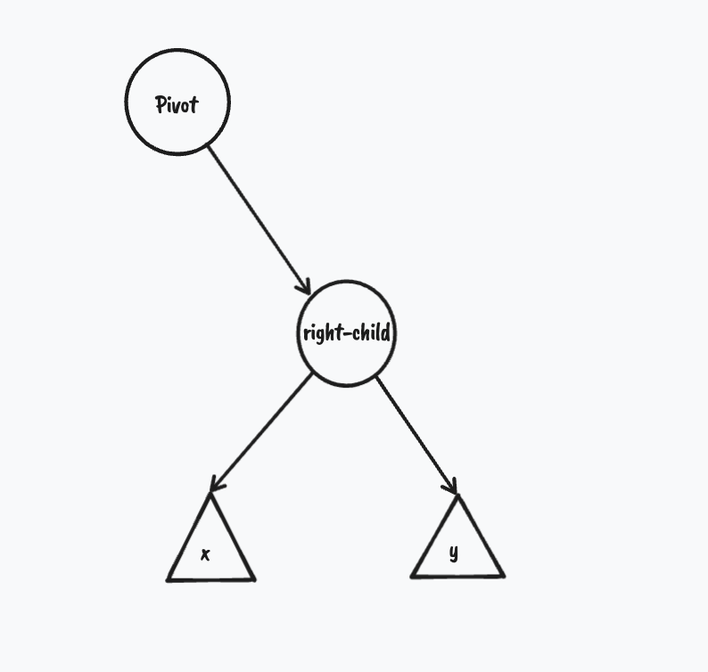

a subtree with Pivot the node we want to start the Left Rotation on.

a subtree with Pivot the node we want to start the Left Rotation on.

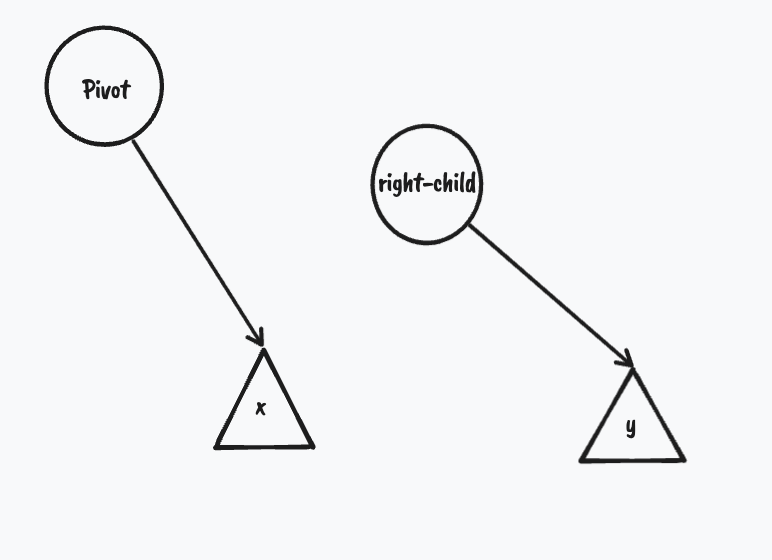

1. The pivot becomes the right-child→left 

the subtree after Left Rotation.

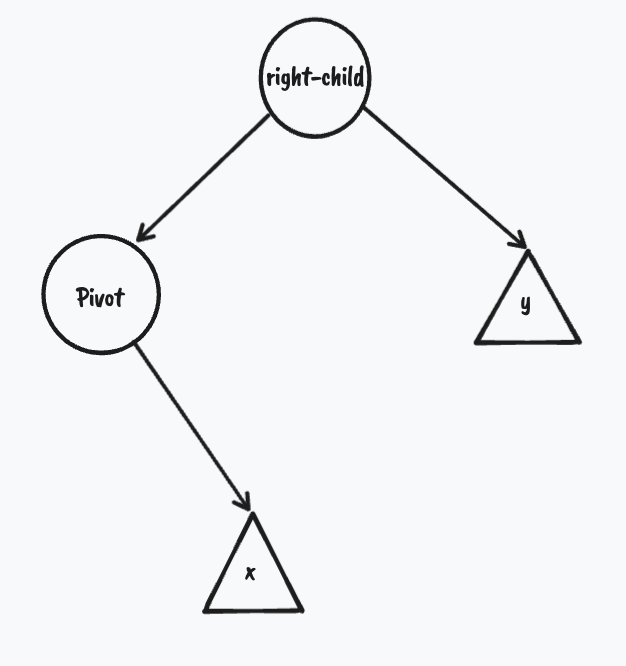

the subtree after Left Rotation.

### Right Rotation :

Repeat the same steps but with the left-child this time

subtree to Right Rotate.

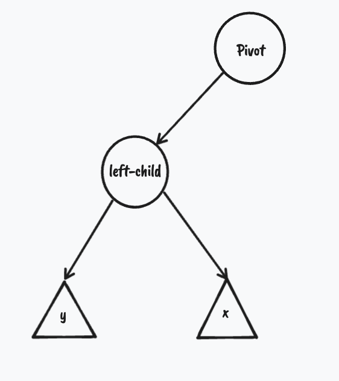

subtree to Right Rotate.

subtree after  Right Rotation.

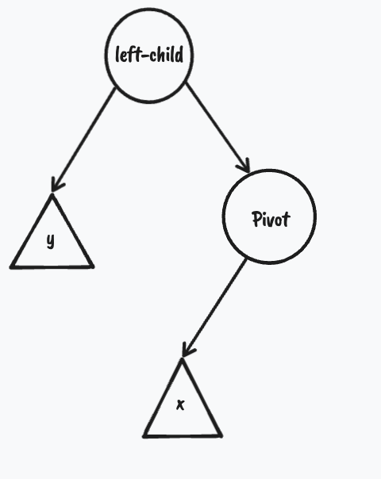

subtree after  Right Rotation.

### Double Rotations.

    Left Right Rotation(Pivot) = Right Rotation(Pivot→right) + Left Rotation(Pivot).

    Right Left Rotation(Pivot) = Left Rotation(Pivot→left) + Right rotation(Pivot)

---

---

## Insertion:

1. insert the key first in the binary search tree with one extra thing (RED color),  every new key inserted is RED so the properties of the Red-Black_Tree can be violated.
2. fix the violation.

<aside>
💡  note:  the insertion can at most violate one rule.

</aside>

**case 1**: the tree is empty *(all good )*.

**case 2**: Parent is Black *(all good)*.

**case 3**: Parent is RED **( property 4 is violated)**

**case 3.1:** Uncle is RED 

1. set the color of parent and uncle to BLACK and grandParent to RED 
2. move node to the grandparent and repeat.

**case 3.2:** Uncle is BLACK

case 3.2.1: Parent is a right_child and node is a right_child.

  1. set the color of the parent to BlACK and the grandParent to RED.

1. Left-Rotate the grandParent.

case 3.2.2: Parent is a left_child and node is a left_child.

1. Set the color of the parent to BLACK and the grandParent to RED.
2. Right-Rotate the grandParent.

case 3.2.3: Parent is a right_child and node is left_child.

1. move node to the parent.
2. Right-Rotate node.
3. Set the color of the parent to BLACK and the grandParent to RED.
4. Left-Rotate the grandParent.

case 3.2.4: Parent is a left_child and node is right_child.

1. move node to the parent.
2. Left-Rotate node.
3. Set the color of the parent to BLACK and the grandParent to RED.
4. Right-Rotate the grandParent.

*Don’t forget to reset the root’s color to BLACK at the End.*

### Visualization:

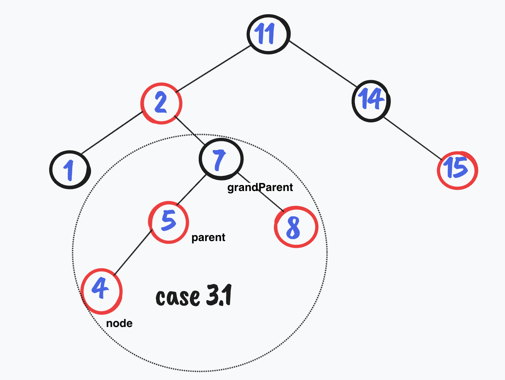

Set color of parent and uncle to BLACK and move node to grandParent. 

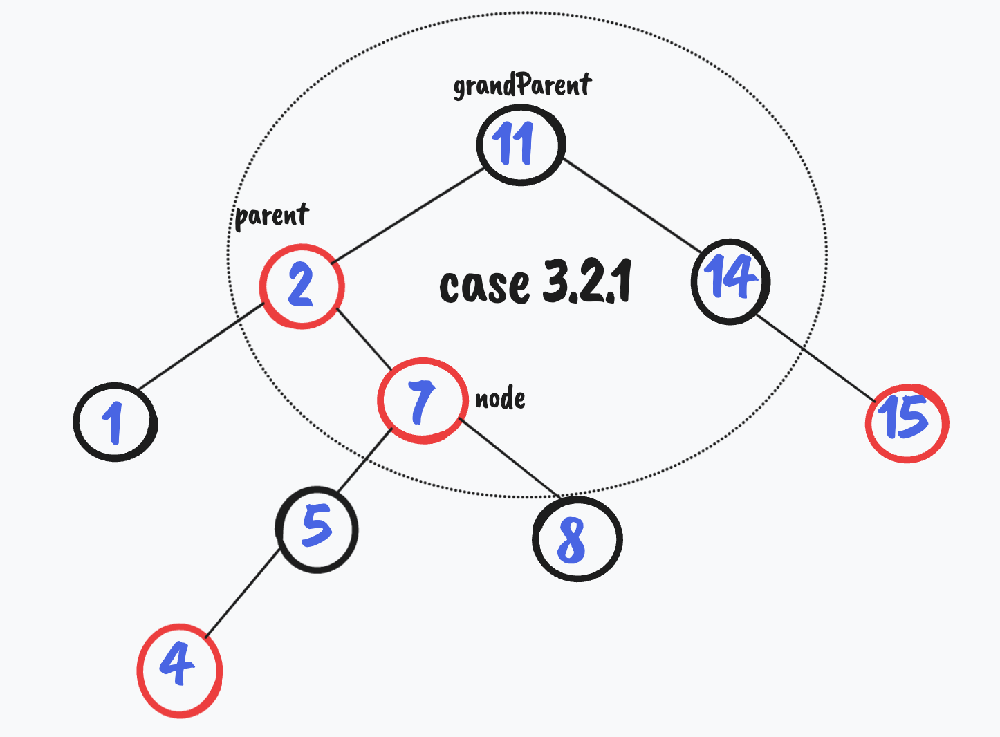

move node to parent and Left-Rotate node.

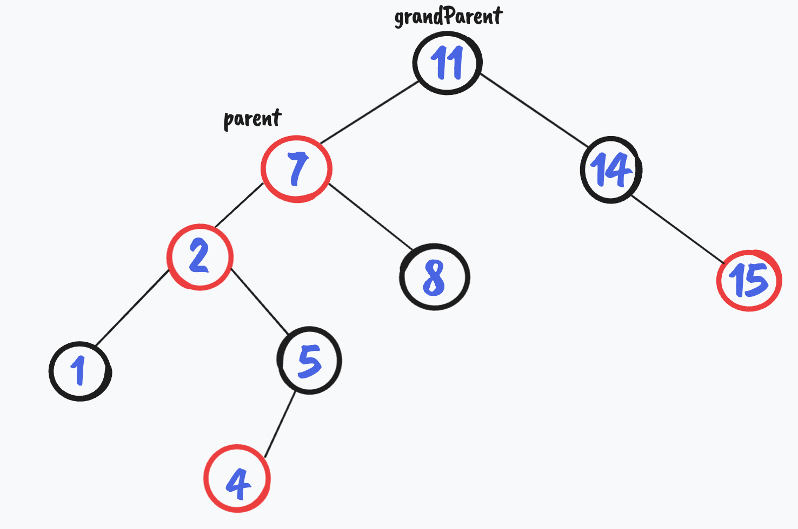

set parent color to Black and grandParent to RED. Right-Rotate grandParent.

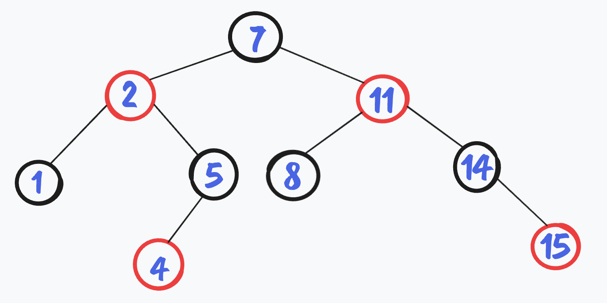

Balanced Red-Black-Tree.

---

---

## Deletion:

 

1. Delete the node following the binary search tree deletion, with some extra modification:
    1. save the color of the node to be deleted (original_color).
    2. if the node has only one child (or none) save the other (or TNULL) in a variable ( let’s name it x). we’ll see later why we need it.
    3. if the node has both children, the successor ( or predecessor) will replace the node with the original color, and now the node to be deleted is the successor (or predecessor), do ‘a’ and ‘b’ for the new node.
2. if the original_color is BLACK and the node x is also BLACK (we have a DOUBLE BLACK node) a black node is replaced with a black node, FIX IT.

### Explanation:

let’s take an example and visualize it:

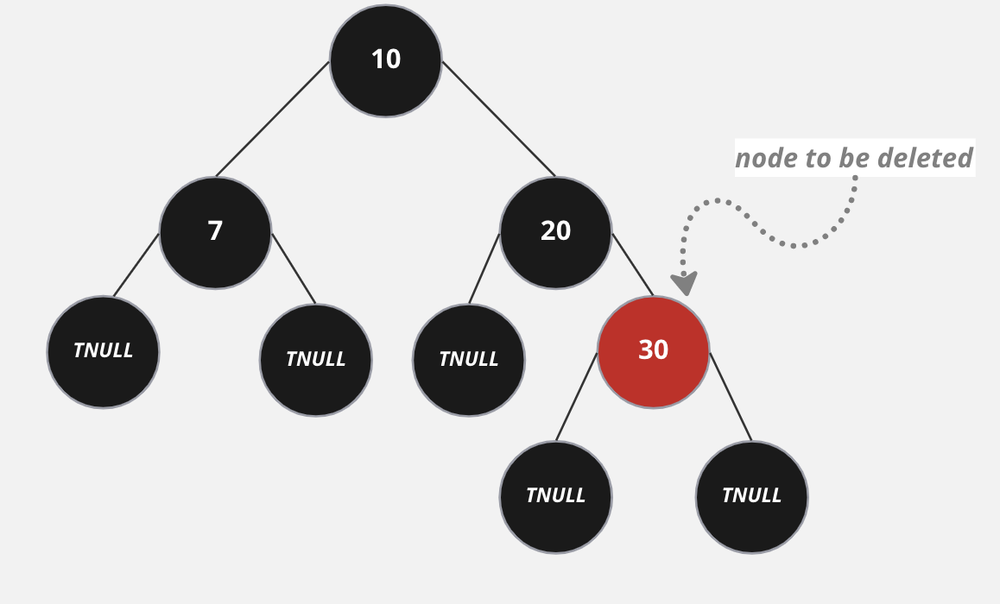

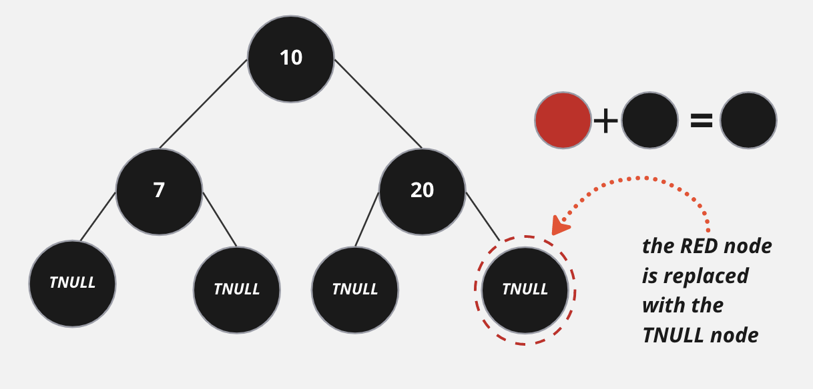

By deleting a RED node no property can be violated.

### **What if we delete a BLACK node?**

It’s called a double black node cause we replaced a black node with another black node, in other words, there are *fewer black nodes now on that subtree* which **violates** the **BLACK DEPTH property**, and we have a black node that we need to put somewhere else so we can have a balanced Red Black Tree again.

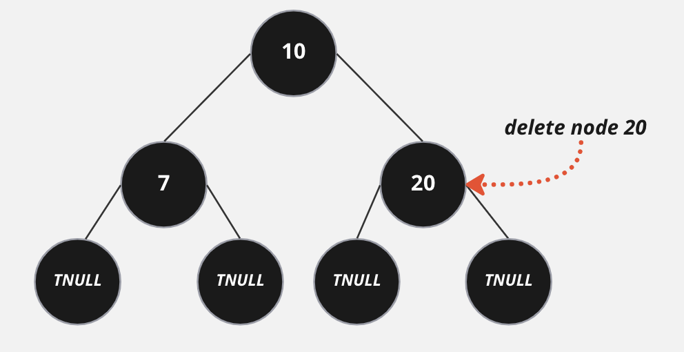

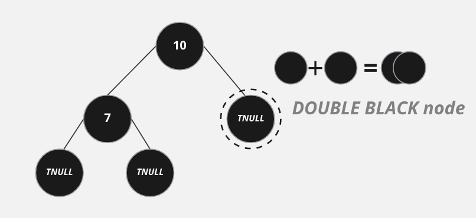

To solve this problem and Balance the tree, there are 4 cases (plus 4 which are just mirror cases)

to do so we need the sibling of the DOUBLE BLACK node (X which is BLACK as we said before), we’ll call it W.

***keep one thing in mind we have an extra black we have to find for it a new place.***

### case 1: *W (sibling of X) is RED*

1. left rotate X.p so that node 65 can be the root.
2. set color of 65 to BLACK: the subtree of 65 still contains the same number of black nodes nothing changed.
3. make W the new x.p.right.

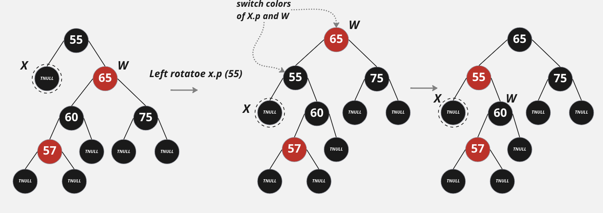

But as you can see the **DOUBLE BALCK** problem still **exists.** but now it’s a different case.

### case 2:

### W is BLACK, the furthest child; in our case the right child ( but in the mirror case it will be the left child), is BLACK, and the nearest child to X is RED.

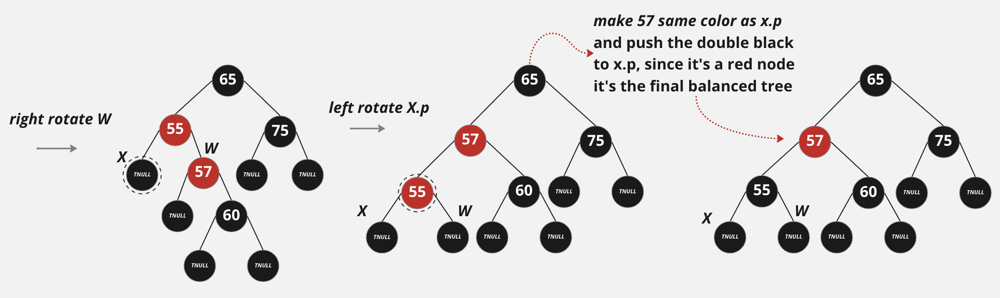

in this case, we need to make the w.child the root, and as you see we need a double rotation to do so.

by doing these rotations w found a new place for the BLACK color and re-balanced the tree.

NOW What if the furthest child is RED?

### case 3:

### **W is BLACK, and the furthest child is RED, the color of the nearest child does not matter.**

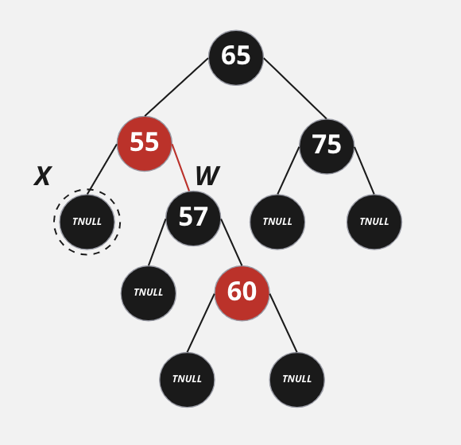

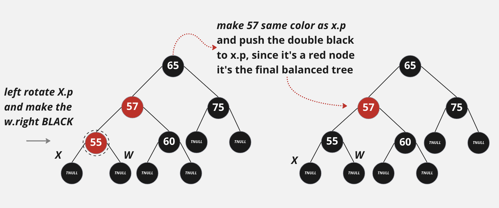

left rotate x.p, push the extra BLACK  to x.p, and the RED fo x.p the node 57, and the BLACK of 57 to 60 **TADA!**

one case left.

### case 4:

### W is BLACK, and both children are BLACK

1. Set the color of w to RED.
2. move the extra BLACK to X.p (if it’s RED; all good) else it’ll be one of the cases above.

**notes:**

cases (1,2,4) the problem may still exist, so you need to continue the balancing until x is the root

---

---

## Conclusion:

I tried to explain the idea of insertion and deletion from the beginning, and how to fix the balance. I didn't explain the code, because the code there on internet is very optimized, and it’s hard to understand the logic behind it, I recommend starting by understanding how things work and writing the first version of the code (full of repetitions)  then go for the optimized version available

again

1.  **Insertion** ⇒ we try to remove one extra RED when it violates a rule
2.  **Deletion** ⇒ we try to remove one extra BLACK 

### Resources:

[Introduction to Algorithm](https://www.amazon.com/Introduction-Algorithms-fourth-Thomas-Cormen/dp/026204630X)

[https://www.programiz.com/dsa/red-black-tree](https://www.programiz.com/dsa/red-black-tree)

[https://algorithmtutor.com/Data-Structures/Tree/Red-Black-Trees/](https://algorithmtutor.com/Data-Structures/Tree/Red-Black-Trees/)
